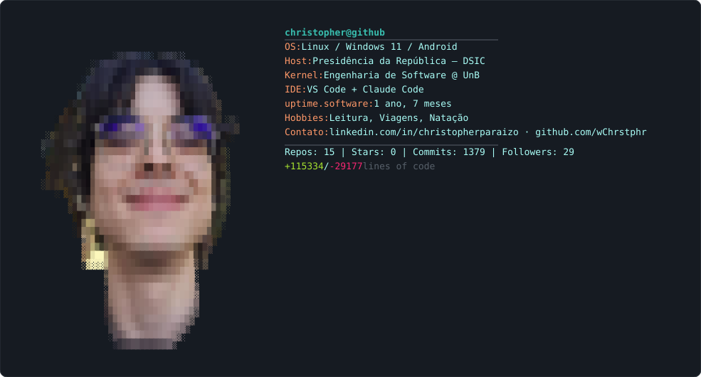

  

  

## 🚀 Sobre Mim

Sou um estudante de Engenharia de Software que ama descobrir, aprender e testar novas tecnologias. Busco constantemente expandir meu aprendizado aplicando conhecimento em projetos desafiadores.

Alguns projetos que gosto de destacar: [`portfolio`](https://github.com/wChrstphr/portfolio), [`sentiment-analysis`](https://github.com/wChrstphr/sentiment-analysis) e [`Mestrado`](https://github.com/wChrstphr/Mestrado).

## 🛠️ Tecnologias e Ferramentas

### Linguagens de Programação

### Front-End

### Back-End e Banco de Dados

### Ferramentas e DevOps

## 💻 Atividade no GitHub

  <picture>
    <source media="(prefers-color-scheme: dark)" srcset="dark_mode.svg">
    <source media="(prefers-color-scheme: light)" srcset="light_mode.svg">
    
  </picture>

## 📫 Contato

  

